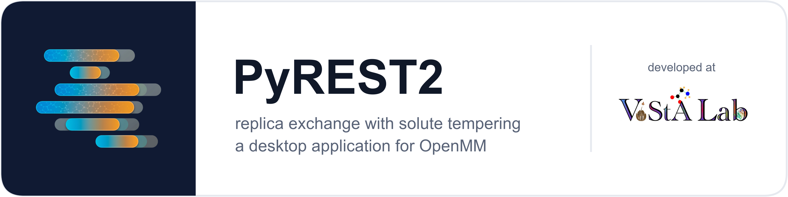

<p align="center">
  
</p>

<p align="center">
  <a href="https://github.com/yashr103/PyREST2/actions/workflows/build-macos.yml">
    </a>
  <a href="LICENSE"></a>
  
  
</p>

A desktop GUI (PySide6) for creating, executing, and evaluating **REST2 replica
exchange solute tempering** simulations using OpenMM and openmmtools, for both
**protein–ligand complexes** and **protein-only (apo)** systems.

**[USER_GUIDE.md](USER_GUIDE.md)** is a comprehensive guide that explains every
setting, how to choose the replica ladder, how to read the results, and how to
debug.

## Pipeline

| Step | Module | What it does |
|------|--------|--------------|
| 1. PDB Preprocessing | `pdb_preprocessing.py` | Cleans the input PDB with PDBFixer (missing atoms/residues, hydrogens, chains) |
| 2. Ligand Prep | `ligand_prep.py` | Parameterizes the ligand with antechamber / parmchk2 (skipped for protein-only) |
| 3. System Generation | `system_generation.py` | Builds and solvates the system with tleap, then creates the OpenMM system |
| 4. Output format | GUI | Nonbonded, constraint, and hydrogen-mass-repartitioning settings |
| 5. Simulation run | `simulation_run.py` | EM → NPT → NVT equilibration, then REST2-REMD production |
| 6. Analysis | `analysis.py` | Exchange diagnostics, RMSD / Rg / RMSF, free-energy surface, energy decomposition |

For apo runs, choose **System type → Protein only** in step 1. So that the
replica ladder and timing consistently match the production run, the run writes
`run_metadata.json` to its output directory, which is then read by the analysis.

## Setting Up

### Option A: conda (which comes with AmberTools)

```bash
conda env create -f environment.yml
conda activate rest2-remd
```

### Option B: pip

Run this from the repository root (the file uses a relative path to refer to the
bundled `third_party/mpiplus`):

```bash
pip install -r requirements.txt
```

Because the upstream release does not build on Python 3.12+, mpiplus (MIT,
Chodera Lab) is packed in `third_party/` with an updated versioneer, and
openmmtools is installed from its GitHub release archive.

Steps 2 and 3 require **AmberTools** (`tleap`, `antechamber`, `parmchk2`), which
pip is unable to install. Install it independently using conda:

```bash
conda install -c conda-forge ambertools
```

Next, either launch the application from that active environment or type the
path of the environment into the "Conda environment path" box on the Ligand Prep
and System Generation pages. A pip-only install may do simulations and analysis
on an existing `.prmtop`/`.inpcrd`, as steps 5 and 6 do not need AmberTools.

Install OpenMM's CUDA plugin for NVIDIA GPUs in accordance with your driver,
such as `pip install "openmm[cuda12]"`, then choose the CUDA platform on the
Simulation run page.

## Usage

```bash
python main.py
```

The command line may also be used to execute the production and analysis phases:

```bash
python simulation_run.py --prmtop complex.prmtop --inpcrd complex.inpcrd --protein-only --output-dir rest2_output
```

```bash
python analysis.py --dir rest2_output --top complex.prmtop --ref complex.pdb --out analysis_output
```

Instead of `--protein-only`, use `--ligand-resnames MOL` for a protein–ligand run
(use the ligand's residue name from your topology).

The standalone utilities are `dcd_extraction.py` (writes DCD trajectories from
the `.nc` storage) and `fes_with_structures.py` (free-energy surface annotated
with structures). Run either script with `--help` for all options.

## Benchmarking

`benchmarks/validate_rest2.py` verifies that the REST2 Hamiltonian is constructed
correctly on your own system (reference-state identity, λ-scaling law,
finite-difference forces, NVE energy conservation, GPU vs double-precision
agreement) and, given a production directory, recalculates the stored
replica-exchange energies:

```bash
python benchmarks/validate_rest2.py --prmtop complex.prmtop --inpcrd complex.inpcrd --ligand-resnames MOL --run-dir rest2_output
```

For information on each check, when to perform it, and how to verify runs made
with prior versions, see [benchmarks/README.md](benchmarks/README.md).

## Optional: compiled build

Cython is used to compile the auxiliary modules via `setup.py`:

```bash
pip install Cython
```

```bash
python setup.py build_ext --inplace
```

## License

MIT; refer to [LICENSE](LICENSE).

A packaged copy of [mpiplus](https://github.com/choderalab/mpiplus) (MIT, Chodera
Lab) is included in `third_party/mpiplus/` and maintains its own license in
`third_party/mpiplus/LICENSE`. The other dependencies (OpenMM, openmmtools,
ParmEd, MDTraj, PDBFixer, PySide6, and AmberTools) are installed independently
and have distinct licenses.

## Credits

Yashkumar Rathod and Sumit Biswas, **ViStA Lab**, BITS Pilani - K K Birla Goa Campus.

<p align="center">
  
</p>

Both marks live in `assets/` and are rebuilt from the two logos the
application ships with (`i.png`, `v.png`) by `python assets/make_banner.py`.
